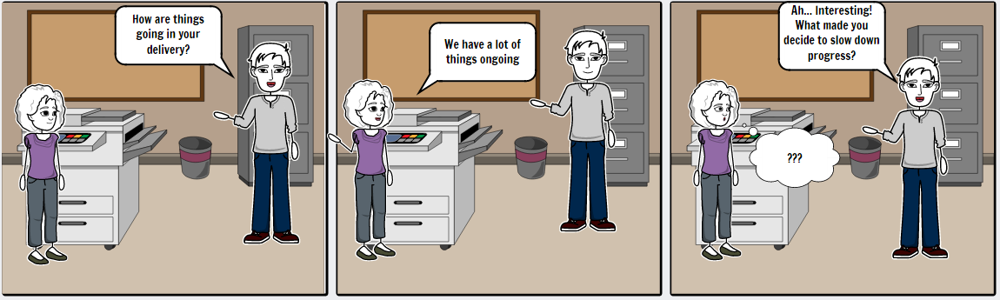
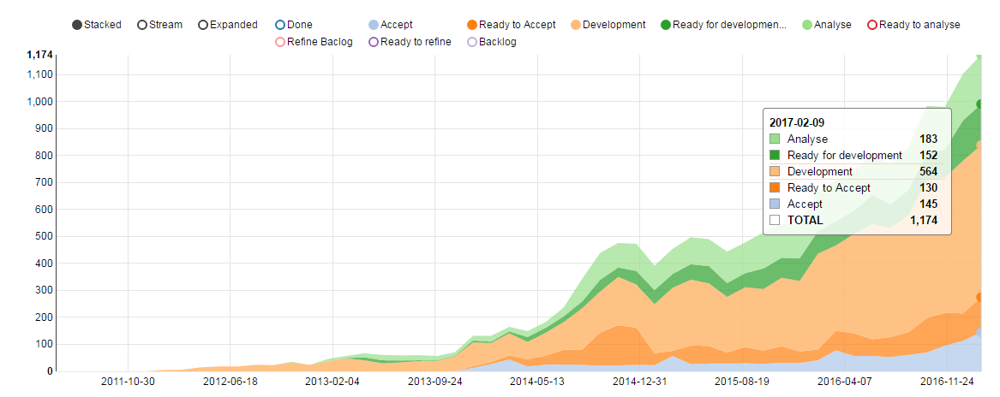
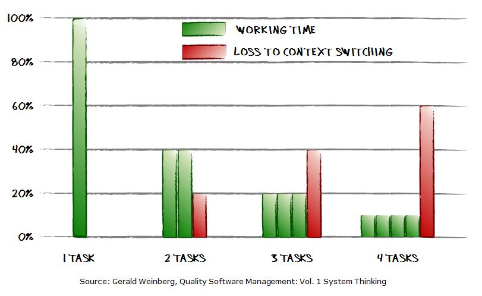

#### and why you should care.

_Lotta in delivery X meets coach Alex by the printer_ 

Almost all organizations with a successful product/service has the same problem. So many things to do and not enough capacity to do them all. They started out as a small team of people who could do wonders in a short amount of time. Then they launched and got customers. The customers loved their service but they all wanted it tailored 
to their specific preference or need. The list of requests grew exponentially. The organization scaled up with more teams to keep up with demand but it didn�t seem to help. The general perception in the organization is that things are moving slower and slower and things are not getting done.

#### Why is that?

There is many reasons why this happens but today I�m only going to cover one. Work in progress (WIP).
In most of the organizations described above the amount of work in progress has grown a lot faster 
than their capacity to finish work. 

_In this picture you see a graph of the growing WIP in an organisation_ 

#### Why growing WIP is a problem? 

1. **Longer lead times:** By working on many things in parallel we divide our delivery capacity between many work items. The decision to start new work without finishing the work you are currently doing you also decide to delay the completion of your already ongoing work
2. **Reduced delivery capacity:** Many people claim to be good multitaskers. That is not true. [Humans are lousy multitaskers](http://brodzinski.com/2013/11/multitasking-teams.html). By switching between different cognitively challenging tasks a part of our cognitive capacity is lost and results in poorer performance on the tasks at hand both in quality and delivery capacity.
 
3. **Reduced agility:** By having many things going on in parallel we delay our deliveries which delays our feedback. When we actually get the feedback we have already a lot of work ongoing and possibly almost done that might need to be changed to act on the feedback or that might not be important anymore then that effort is wasted and it is a lot harder to change direction.

#### Proioritisation

It all boils down to one thing. Prioritization. High WIP is a sign of lacking prioritization. By allowing more work to start than we are able to complete we signal that someone else can decide the priority on what to work on. Agile emphasize the importance of maximizing the work not done in the meaning that if we can achieve 50% of the benefit with only 20% of the effort we have the choice to either invest more to get the rest of the benefit or if we want to use the remaining time  to do something more important. Many organizations feel they cannot do this prioritization as they have promised to deliver a full scope or says all deliveries are as important. Not prioritizing is a lose lose proposition as it is a decision to deliver less benefit and to deliver later than would have otherwise been possible.

 