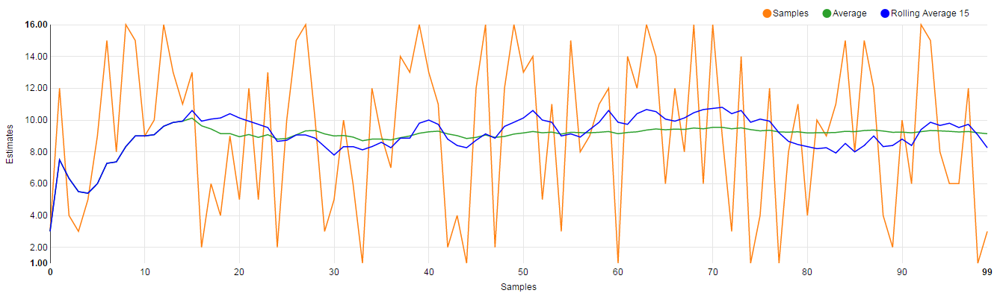
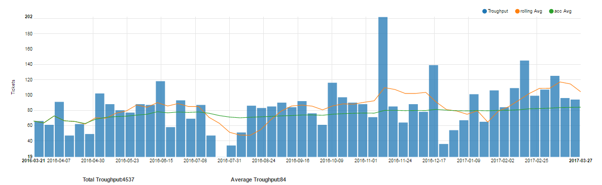

Knowing your delivery capacity is an important ability in any organization who 
delivers products or services to customers. Traditionally we have looked at 
this as a simple linear equation where you count capacity in available working 
hours and in order to get more delivery capacity you either work longer hours or 
you hire more people.

When a customer comes and asks for some delivery, it is estimated how long it will
take and then we look at the available working hours to see when we can do the work, 
when it will be done and how much it will cost. This model works reasonably well in 
areas with small deliverables where the mechanical component of the work is high and 
the creative / exploratory component is small.  

Agile methodologies all disconnect estimates from time units and emphasize rough estimation.
It also emphasize the importance of measuring progress only in done and delivered items.  
Capacity is measured by how much estimated effort those done items represent.

In scrum this is done with story point estimation and the team capacity is called velocity.

This works reasonably well on the team level but in larger organizations with many teams, 
this model has its challenges. The biggest challenge is that points can not be compared 
between two teams.  So 32 points in Team 1 might very well be 64 points in Team 2 and 
therefore it is not meaningful to aggregate them.  

#### The power of many small things

**So what is the capacity of an organization with many teams working together?**  
Just count the number of items delivered by the organization/time unit.
**But they are not the same size?**  
No, but granularity does not matter as much as most of us believe.
Stories are relatively small and in a big organization we have a lot of them.
It is the same mechanics that is the core of any estimation aggregation scheme.
Say we run a simulation where we randomly select a number between 1 and 16.
You do not need many rounds to get to an average between 6 and 10 so even 
if they are in more than one order of magnitude range, the average size very quickly converge.     
So if we believe that the size distribution for stories to deliver is roughly the same
in the near future as it has been in the near past, we are ok with just counting stories.
This measure is called Throughput.

##### Simulation 

_100 random estimates in the range of 1 to 16. Notice it only takes 15 estimates span to get 
a rolling average (blue line) that is quite stable over time in this simulation_ 

##### Is it a story?

_The question is wether something is a story or not and all stories has the size 1_  

##### Throughput

_This data shows an organizations throughput over the last year the average is 84 stories/week
recently the average throughput has been over 100 stories/week. We can see the throughput dropping
on holiday seasons and we can see some spikes in throughput that are probably cleanups or rushing 
to the end of a delivery_ 

#### Capacity is not Performance

Most peoples reaction when they see the throughput of their organization is to ask things 
like **Is that good?**, **What should it be?**. Throughput measures capacity and capacity 
is not the same thing as performance. All organizations have a higher demand (things they 
could do with their capacity) than their capacity to deliver. Our performance is the result 
of what we decide to do with our capacity. Focus should be on prioritization of how to use 
the available capacity to get the biggest possible benefit.  

#### Allocate capacity.

If you decide to do many initiatives in paralell it is important to understand that allocating capacity to one initiaive inevitably takes capacity away from another initiative. By looking at the throughput and filter it 
by initiative you get almost instant information on what capacity different initiatives consume and get data to
be used for driving discussions on future priorities and for forecasting purposes 

