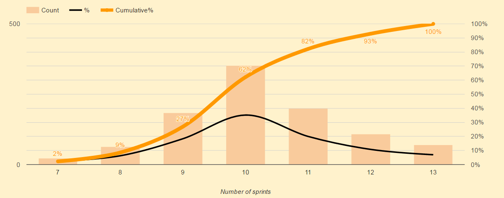

# Agile forecasting.

In general Agile methods optimise for agility and customer value. 
It is natural since the methodology is based
on the fact that we can not know what the right solution will be
until we have delivered it. Many organisations aims to be predictable 
and this is somewhat at ods with agility.  

#### Forecasting

The basis for any forecasting is that the forecast about what will happen 
in the near future has a bigger chanse of being accurate than forecasts 
that go long into the future. 
We know this from weather forecasts where we know that what is forceasted
for tomorrow has a greater chance of actually happen than  whatever is 
forecasted for a week from now but the longer term forecast could still be valuable as an 
indication for planning purposes.

#### Other things that inpacts our ability to do forecasts in a positive way?  
* **Stable environment:** stable prioritizations and scope over time  
* **Few dependencies:** Low dependency count lowers variance and improve control.    
* **Low Work in progress:** Low wip reduces variance and shortens duration for individual deliveries  
* **Small deliverables:** Small deliverables give more meassuring points, reduce variance and give better control.

Agile has ways to do forecasting built in. All of them are based on 
looking at what we have been able to deliver in the past and project 
that progress on our backlog as it looks now. 

One thing that many people don´t know is that agile forecasting is 
not about comitment to deliver a certain scope at a certain time. 
It is a tool to communicate how the future could look given what 
we have completed recently projected on our current understanding 
of what we will deliver in the future no more and no less. 

It is important to remember that any atempt to be accurate on what 
to deliver in the future will limit our ability to act on new knowledge 
and change priorities and thereby deliver a higher customer value. 
So in general we should limit our commitments to the near future and 
to a fraction of our capacity to mantain flexibility.

Scrum works with a prioritized and estimated backlog and team velocity 
to do forecasting. This means that you have a list of all stories to 
deliver in a backlog. All stories are estimated and we use the velocity 
(estimated effort of work completed in a sprint) to project what could 
be delivered when. This is a good way to handle a known scope but it 
has some drawbacks as it assumes we know the scope and it might be that
we spend too much time breaking down the scope into stories and estimate 
them and then we discover that we should build something else.  

#### Forecasting with flexible scope
The **[#NoEstimates](https://www.youtube.com/watch?v=7ud-4bKJr8k)** community has given us techniques to do forecasting with 
flexible scope. The trick they use is to just count stories and size the 
initiative into stories without determining what stories will be delivered 
and the assumption that the size distribution between stories in the scope 
will be stable over time. Say that we want to do a release and we believe 
it takes 100 stories to reach the goal then we can follow our throughput 
iteration by iteration and base our forecasting on that throughput. That way 
we are predictable as long as we can reach the goal within the 100 stories. 
[The methods has shown to be at least as accurate as scope based forecasts with 
estimates on the individual stories](https://www.youtube.com/watch?v=7ud-4bKJr8k).  The forecast can be done with a simple 
best/worst case throughput with as little as 3 iterations data as its base. 
A more sofisticated method is to do a Monte Carlo simulation.

Lets look at an example 

**Remaining stories:** 50  
**Recent throughput:** 4,6,8,4  
**Best case:** 7 iterations (througput 8)  
**Worst case:** 13 iterations (througput 4)  
**Average speed:** 10 iterations (througput 5.5)  

A Monte Carlo simulation on the same data would give us a graph showing the range of iterations to a forecasted completion with probabilities and accumulated probabilities. 
