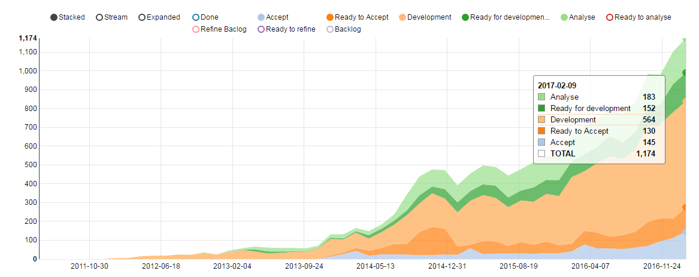
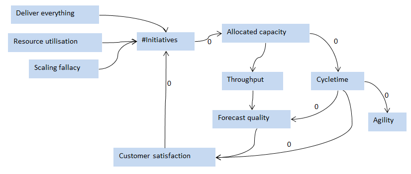
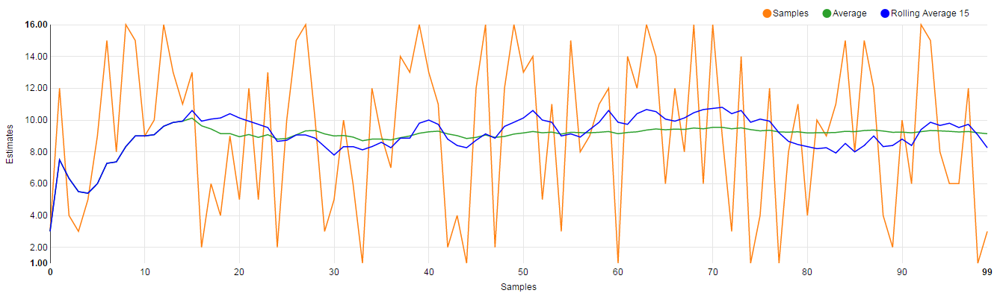
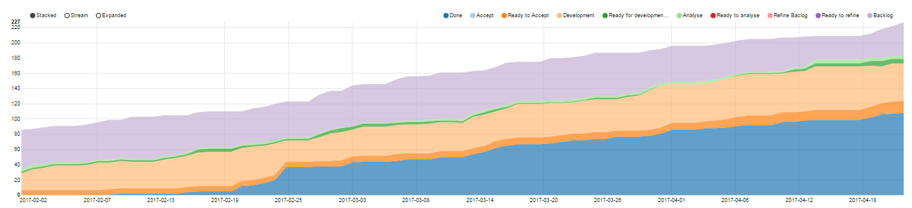
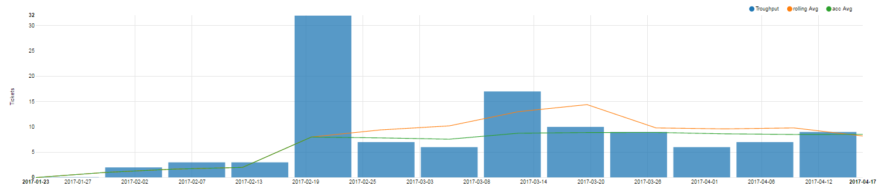
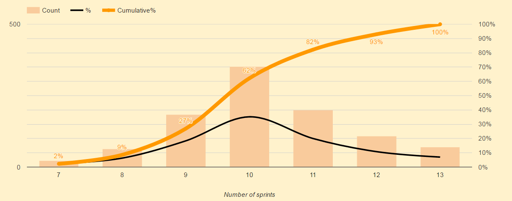

# Agile Capacity management and forecasting

---

## How do you measure capacity?

Note:

Most orgs measure capacity in available development hours. 
Scrum uses Velocity (storypoints delivered/time unit) 

<!--verticalSeparator-->

## What happens when we don´t understand our capacity?

<!-- .element: class="fragment" -->

<!--verticalSeparator-->

## How we got there!

<!--verticalSeparator-->

Remember
## Capacity != Performance

Performance is what we manage to achieve with the capacity available<!-- .element: class="fragment" -->

---

## Throughput = Capacity 

<!--verticalSeparator-->

### Story size matters less than we think

100 random samples between 1 and 16

<!--verticalSeparator-->

## Benefits  
 
* No need to know what individual stories to deliver
* Data gets better the more stories we deliver

<!--verticalSeparator-->

## Limitations

* Size distribution needs to be fairly stable over time

---

# Planning for Initiatives.

<!--verticalSeparator-->

## Size 

(1,2,4,8,16,32,64 ... )stories 

 or

$$ budget \over averageStoryCost $$ 

<!--verticalSeparator-->

## Cost

$$ budget = {size * averageStoryCost}$$

<!--verticalSeparator-->

## Timeframe

$$ deliveryDate = start +{size \over allocatedCapacity} $$

$$ neededCapacity = {size \over weeksToDelivery} $$

---

# Managing

<!--verticalSeparator-->

### Progress follow up 

 

<!--verticalSeparator-->

### Forecasting

 